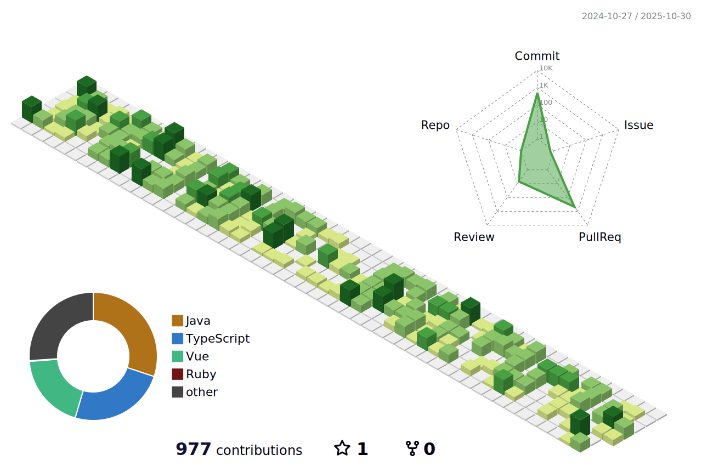

	

 

	<h3>🩺Primary Major🩻</h3>
Biomedical Engineering

	<h3>🖥️Double Major🖥️</h3><a>Computer Science</a>

 
 

	<h3>📚 Tech Stack 📚</h3>
	
✨ Platforms & Languages ✨

	
	
	
	
	 
	
	
	
	 
	
	
	
	
	
	 
	
	
	
	

 

	
🛠 Tools 🛠

	
	
	
  	
	 
	
	

 
 
 
 
<!--
<table border-collaspe = collaspe, align = center>
<tbody>
<tr style="width: 100%;">
<td style="width: 50%;"></td>
<td style="width: 30%;"></td>
</tr>
</tbody>
</table>
-->

 

